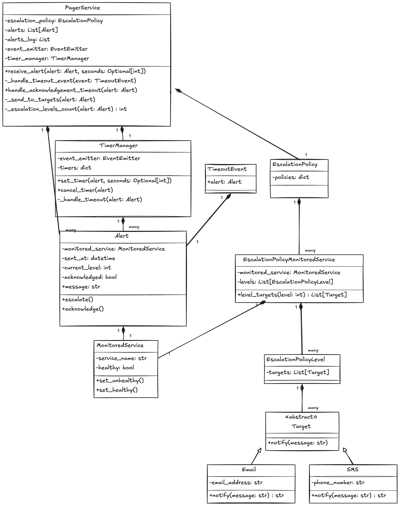

# Pager

This project is a simple implementation of a Pager that receives alerts from Monitored Services and notifies the targets of an escalation policy.

## Installation

Run the following command to install the project dependencies:

```bash
./setup
```

This will install the project dependencies and create a virtual environment.

## Running the tests

Run the following command to run the tests:

```bash
./test
```

# Design

First intuition and design of the Pager didn't include any threading or async processing. The Pager would be a simple class that would receive alerts and notify the targets of the escalation policy:


## Adding Threading and the Observer Pattern for the Acknowledgement Timeout

After implementing the first use case, I realized that the Pager would need to keep track of the Timers for each alert.
I added a TimerManager class that would keep track of the timeouts for each alert. The Pager would be responsible for notifying the TimerManager when an alert is acknowledged.

Also, I removed the timer from the Alert class.

To implement the TimerManager, I used the Observer Pattern. The TimerManager would be the publisher and the Pager would be the subscriber. The Pager would be notified when a timer expires.




# Use Cases covered

These are the use cases we're going to implement in this project to test the Pager.

```
Given a Monitored Service in a Healthy State,
when the Pager receives an Alert related to this Monitored Service,
then the Monitored Service becomes Unhealthy,
the Pager notifies all targets of the first level of the escalation policy,
and sets a 15-minutes acknowledgement delay.
```

```
Given a Monitored Service in an Unhealthy State,
the corresponding Alert is not Acknowledged
and the last level has not been notified,
when the Pager receives the Acknowledgement Timeout,
then the Pager notifies all targets of the next level of the escalation policy
and sets a 15-minutes acknowledgement delay.
```

```
Given a Monitored Service in an Unhealthy State
when the Pager receives the Acknowledgement
and later receives the Acknowledgement Timeout,
then the Pager doesn't notify any Target
and doesn't set an acknowledgement delay.
```

```
Given a Monitored Service in an Unhealthy State,
when the Pager receives an Alert related to this Monitored Service,
then the Pager doesn’t notify any Target
and doesn’t set an acknowledgement delay
```

```
Given a Monitored Service in an Unhealthy State,
when the Pager receives a Healthy event related to this Monitored Service
and later receives the Acknowledgement Timeout,
then the Monitored Service becomes Healthy,
the Pager doesn’t notify any Target
and doesn’t set an acknowledgement delay
```
